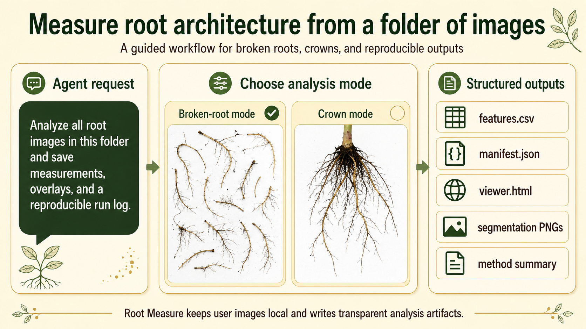

# root-measure

`root-measure` is a Codex plugin for root image measurement built around the
validated RhizoVision Explorer CLI workflow. It packages install checks,
guided usage, transparent run artifacts, and reproducibility-oriented evidence
into a single plugin and CLI.

Current version: `0.2.0-beta`



<a id="chinese"></a>

中文 | [English](#english)

---

## 中文

### 这是什么

`root-measure` 适合这样的请求：

```text
用 Root Measure 分析这个根系图像文件夹，扫描精度是 600 DPI。
```

它保留 RhizoVision Explorer 的科学测量核心，同时补上更适合 Codex
工作流的外层能力：

- 用统一 CLI 提供稳定入口
- 用 `doctor` 和 `release-check` 做安装与发布校验
- 用 `viewer.html`、`run_manifest.json`、日志和中间图像保留证据链
- 用 `raw --` 保留完整 `rv.exe` 参数透传能力

### 能测什么

Root Measure 读取 RVE 输出并生成 `features.csv`。常见指标包括：

- 根长、表面积、投影面积、体积
- 根尖数、分枝点数、分枝频率
- 平均直径、中位直径、最大直径
- 按直径范围分箱的长度、面积、表面积和体积
- 运行诊断信息，例如文件名、ROI 和计算耗时

注意：`Computation.Time.s` 是运行时间，不是生物学性状。只有在
`DPI` 或 `pixels/mm` 正确时，`mm`、`mm2`、`mm3` 才能按真实物理单位解释。

### 常见分析模式

- `broken roots`
  - 适合洗净后铺开的断根、根段或散根扫描图
  - 更关注长度、直径、面积、体积和拓扑指标
- `whole root / crown`
  - 适合完整根系、根冠或 seedling crown 图像
  - 更关注整体结构、形态和可视化证据

如果高层 `measure` 命令没有暴露你需要的某个 RVE 参数，可以用：

```powershell
<plugin-root>\bin\root-measure.cmd raw -- <rv.exe arguments>
```

### 面向 Codex 用户

如果你通常是直接让 Codex 帮你安装和分析，推荐这样用。

#### 从 GitHub 安装并校验

告诉 Codex：

```text
Install this Codex plugin and verify it with release-check:
https://github.com/Rimagination/root-measure
```

安装后运行：

```powershell
<plugin-root>\bin\root-measure.cmd release-check
```

通过时应看到 `status: pass`。

如果 Codex Desktop 只弹出笼统的“plugin install failed”，请看
[docs/installation.md](docs/installation.md)。

#### 第一次分析自己的数据

可以直接对 Codex 说：

```text
用 Root Measure 分析 D:\data\scans，扫描精度是 600 DPI。
```

如果你不确定该怎么选模式或参数：

```text
Start the Root Measure guided workflow.
```

等价命令：

```powershell
<plugin-root>\bin\root-measure.cmd wizard
<plugin-root>\bin\root-measure.cmd measure --input D:\data\scans --dpi 600 --preset broken-roots
<plugin-root>\bin\root-measure.cmd measure --input D:\data\roots --pixels-per-mm 13.27 --preset whole-root
```

### 输出内容

每次高层分析都会生成一个结果目录。默认情况下，结果会写到输入路径旁边的：

```text
root-measure-results\root-measure-<timestamp>
```

常见产物包括：

- `features.csv`：测量结果表
- `viewer.html`：本地结果查看页
- `viewer-data.json`：viewer 使用的数据
- `run_manifest.json`：输入、参数、工具 hash 和产物记录
- `rv.stdout.txt`、`rv.stderr.txt`、`rv.log`：运行日志
- segmentation 与 feature overlay 图像

常用命令：

```powershell
<plugin-root>\bin\root-measure.cmd runs --path D:\data\scans --limit 10
<plugin-root>\bin\root-measure.cmd inspect --run <run-folder>
<plugin-root>\bin\root-measure.cmd doctor
```

### 公开数据复现

只有在你手头已经有 `expected CSV` 或历史 baseline 时，才进入复现对比流程。

```powershell
<plugin-root>\bin\root-measure.cmd compare --actual <features.csv> --expected <expected.csv> --key File.Name
```

如果 expected 表里 `File.Name` 有重复：

```powershell
<plugin-root>\bin\root-measure.cmd compare --actual <features.csv> --expected <expected.csv> --key File.Name --duplicate-key-mode BestMatch
```

GitHub `imageexamples` 更适合 smoke test，不应直接当作官方数值标准答案。

更多说明见 [docs/reproducibility.md](docs/reproducibility.md)。

### 文档

- [docs/installation.md](docs/installation.md)：安装与常见安装坑
- [docs/usage.md](docs/usage.md)：日常分析流程
- [docs/reproducibility.md](docs/reproducibility.md)：公开数据复现与对比
- [docs/reproducibility-gotchas.md](docs/reproducibility-gotchas.md)：详细验证踩坑记录

### 教程站点

更完整的 GitHub Pages 教程、参数说明与复现记录见：

- [https://rimagination.github.io/root-measure/](https://rimagination.github.io/root-measure/)

### 参考资料

- RhizoVision Explorer: [https://www.rhizovision.com/](https://www.rhizovision.com/)
- RhizoVision Explorer GitHub:
  [https://github.com/predictivephenomics/RhizoVisionExplorer](https://github.com/predictivephenomics/RhizoVisionExplorer)
- Seethepalli, A. et al. (2021). RhizoVision Explorer: open-source software for
  root image analysis and measurement standardization. AoB PLANTS, 13(6), plab056.
  [https://doi.org/10.1093/aobpla/plab056](https://doi.org/10.1093/aobpla/plab056)
- RhizoVision Explorer Zenodo release:
  [https://doi.org/10.5281/zenodo.3747697](https://doi.org/10.5281/zenodo.3747697)

---

<a id="english"></a>

[中文](#chinese) | English

## English

### Overview

`root-measure` is built for requests like:

```text
Use Root Measure to analyze this folder of root images. The scan scale is 600 DPI.
```

It keeps the scientific core fixed:

- RhizoVision Explorer CLI remains the measurement engine
- the Codex plugin handles install discovery, parameter guidance, run evidence,
  and troubleshooting
- a unified CLI gives agents and advanced users a stable interface
- `raw --` preserves full passthrough access to `rv.exe` arguments

### Traits

Root Measure writes `features.csv` from the RVE output. The exact columns depend
on image type, scale, and CLI parameters. Common outputs include:

- root length, surface area, projected area, and volume
- root tips, branch points, and branching frequency
- average, median, and maximum diameter
- diameter-binned length, area, surface area, and volume
- run diagnostics such as file name, ROI, and computation time

Note: `Computation.Time.s` is runtime, not a biological trait. Provide correct
`DPI` or `pixels/mm` before interpreting `mm`, `mm2`, or `mm3` as physical units.

### Common Analysis Modes

- `broken roots`
  - for washed, separated broken roots or root fragments on scans
  - best for high-contrast white-background scanner images
  - focuses on length, diameter, area, volume, and topology traits
- `whole root / crown`
  - for intact root systems, crowns, or seedling crown images
  - best when the whole architecture should stay visible
  - keeps architecture-oriented outputs and visual evidence

If the high-level `measure` command does not expose a specific RVE argument, use:

```powershell
<plugin-root>\bin\root-measure.cmd raw -- <rv.exe arguments>
```

### For Agent Users

If you normally install and use projects by telling Codex what to do, use this
repository that way.

#### Quick Install From GitHub

Ask Codex:

```text
Install this Codex plugin and verify it with release-check:
https://github.com/Rimagination/root-measure
```

After installation, run:

```powershell
<plugin-root>\bin\root-measure.cmd release-check
```

A good install reports `status: pass`.

Installation is the most technical part of this plugin. If Codex Desktop only
shows a generic "plugin install failed" toast, see
[docs/installation.md](docs/installation.md). It covers the local marketplace
layout, the real Codex plugin cache path, strict UTF-8 manifest files, and the
BOM issue that can make a valid-looking `plugin.json` fail inside Codex.

#### First Run On Your Own Data

You can ask Codex:

```text
Use Root Measure to analyze D:\data\scans. The scan scale is 600 DPI.
```

If you are unsure which settings to use:

```text
Start the Root Measure guided workflow.
```

Equivalent commands:

```powershell
<plugin-root>\bin\root-measure.cmd wizard
<plugin-root>\bin\root-measure.cmd measure --input D:\data\scans --dpi 600 --preset broken-roots
<plugin-root>\bin\root-measure.cmd measure --input D:\data\roots --pixels-per-mm 13.27 --preset whole-root
```

For new user data, you usually do not have an expected CSV. Root Measure focuses
on measurement and quality control: image count, scale, exact command arguments,
output rows, generated viewer, intermediate images, and logs.

### Outputs

Each high-level run writes a run folder. By default, Codex places it next to
the input path under `root-measure-results\root-measure-<timestamp>`. Important
files include:

- `features.csv`: measurement table
- `viewer.html`: local review page
- `viewer-data.json`: data used by the viewer
- `run_manifest.json`: inputs, parameters, tool hashes, and artifacts
- `rv.stdout.txt`, `rv.stderr.txt`, `rv.log`: execution logs
- segmentation and feature overlay images

Useful commands:

```powershell
<plugin-root>\bin\root-measure.cmd runs --path D:\data\scans --limit 10
<plugin-root>\bin\root-measure.cmd inspect --run <run-folder>
<plugin-root>\bin\root-measure.cmd doctor
```

### Public Reproduction

Use reproduction mode only when you have an expected CSV or a previous baseline.
Root Measure can compare generated `features.csv` to expected results and report
exact matches or differences.

```powershell
<plugin-root>\bin\root-measure.cmd compare --actual <features.csv> --expected <expected.csv> --key File.Name
```

If expected rows contain duplicate `File.Name` values:

```powershell
<plugin-root>\bin\root-measure.cmd compare --actual <features.csv> --expected <expected.csv> --key File.Name --duplicate-key-mode BestMatch
```

The GitHub `imageexamples` are smoke tests, not numeric oracles. Do not claim
official agreement unless `compare` has checked the generated table against the
expected CSV.

More details: [docs/reproducibility.md](docs/reproducibility.md).

### Documentation

- [docs/installation.md](docs/installation.md): Codex installation and known
  install pitfalls
- [docs/usage.md](docs/usage.md): everyday measurement workflow
- [docs/reproducibility.md](docs/reproducibility.md): expected CSV comparison and
  public-data reproduction
- [docs/reproducibility-gotchas.md](docs/reproducibility-gotchas.md): detailed
  validation pitfalls

### Full Tutorial

For the longer GitHub Pages tutorial with step-by-step usage notes, parameter
guidance, and reproducibility records, visit:

- [https://rimagination.github.io/root-measure/](https://rimagination.github.io/root-measure/)

### References

- RhizoVision Explorer: [https://www.rhizovision.com/](https://www.rhizovision.com/)
- RhizoVision Explorer GitHub:
  [https://github.com/predictivephenomics/RhizoVisionExplorer](https://github.com/predictivephenomics/RhizoVisionExplorer)
- Seethepalli, A. et al. (2021). RhizoVision Explorer: open-source software for
  root image analysis and measurement standardization. AoB PLANTS, 13(6), plab056.
  [https://doi.org/10.1093/aobpla/plab056](https://doi.org/10.1093/aobpla/plab056)
- RhizoVision Explorer Zenodo release:
  [https://doi.org/10.5281/zenodo.3747697](https://doi.org/10.5281/zenodo.3747697)
